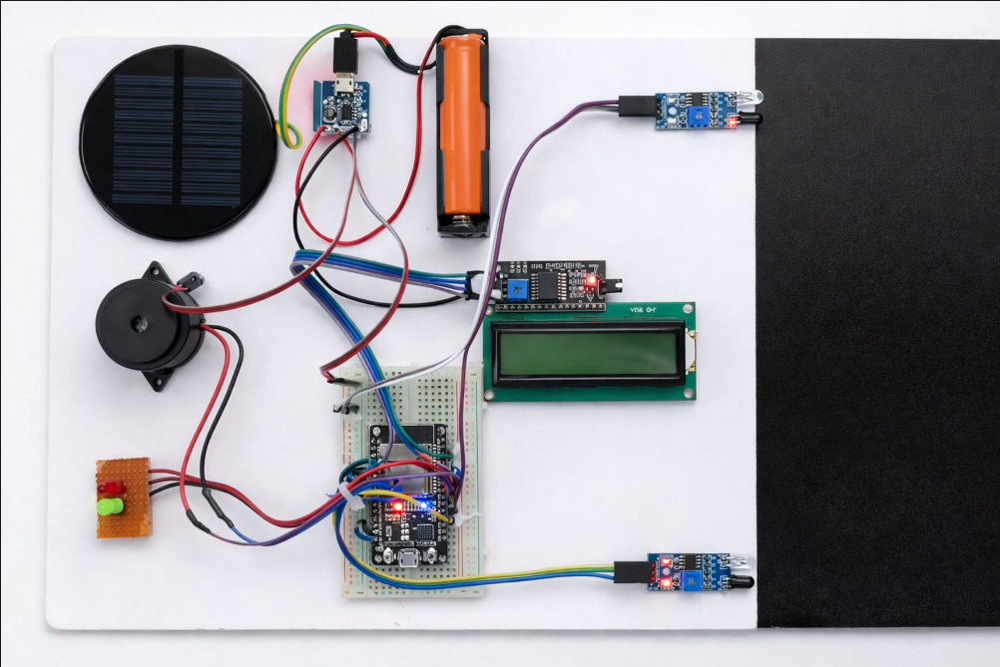
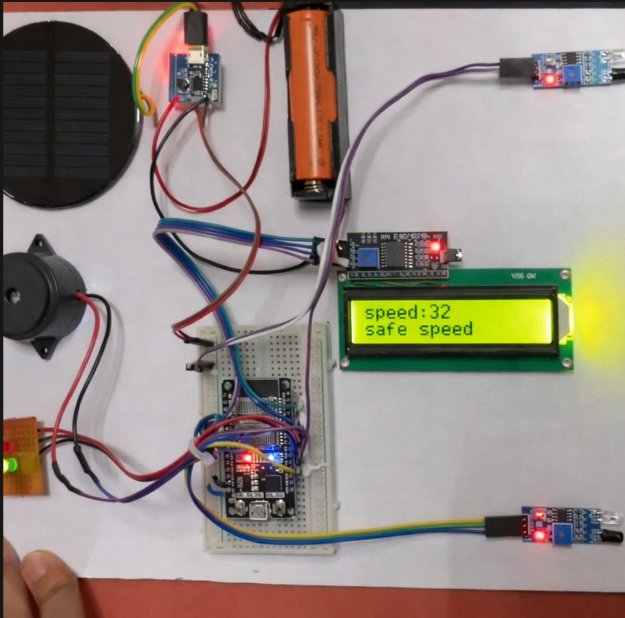
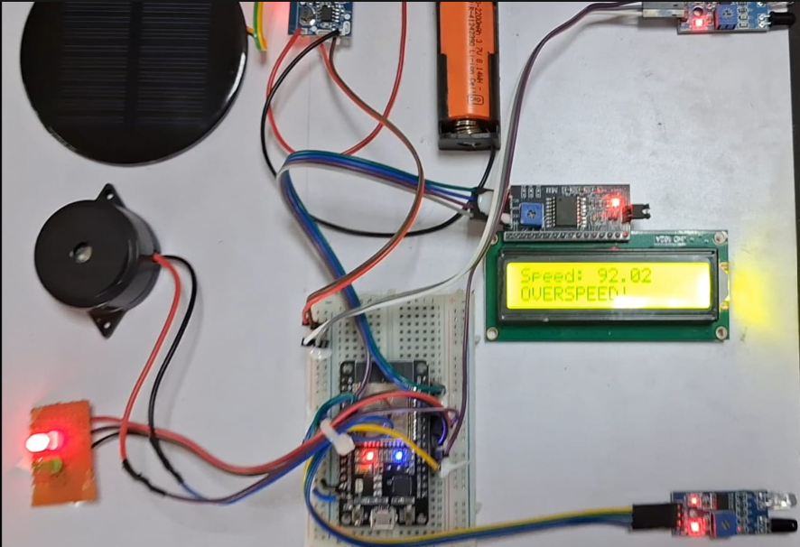
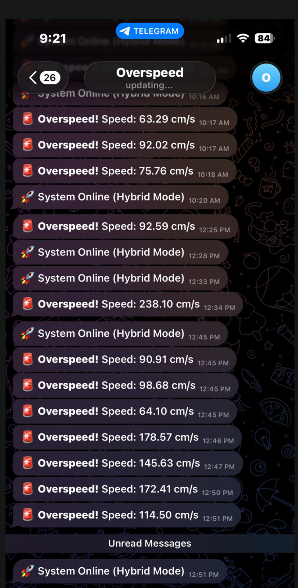

IoT-Based Vehicle Speed Detection and Overspeed Alert System Using ESP32

## Project Overview

The IoT-Based Vehicle Speed Detection and Overspeed Alert System Using ESP32 is an embedded and IoT-enabled system designed to detect vehicle speed and provide an immediate warning when the detected speed exceeds a predefined limit.

The system uses an ESP32 microcontroller and two IR sensors placed at a fixed distance. The time taken by a vehicle to travel between the two sensors is measured, and the vehicle speed is calculated using the distance and time relationship.

The detected speed is displayed on a 16×2 I2C LCD. A green LED indicates safe-speed operation, while an overspeed condition activates a red LED and buzzer. When Wi-Fi is available, an overspeed notification is also sent remotely using the Telegram Bot API.

The system supports both online and offline operation, allowing local speed monitoring and alerts even when an internet connection is unavailable.

## Features

- Vehicle speed detection using two IR sensors
- ESP32-based embedded system
- Real-time speed calculation
- Speed display on 16x2 I2C LCD
- Safe-speed indication using green LED
- Overspeed indication using red LED
- Buzzer alert during overspeed conditions
- Remote overspeed notification using Telegram Bot API
- Supports both online and offline operation
- Local alerts continue even when internet connectivity is unavailable

## System Components

## Hardware Components

- ESP32 development board
- Two IR sensors
- 16x2 I2C LCD display
- Green LED
- Red LED
- Buzzer
- Resistors
- Breadboard and jumper wires
- Power supply

 ## Software and Technologies

- Arduino IDE
- Embedded C/C++
- ESP32
- I2C communication
- Wi-Fi
- Telegram Bot API

## How It Works

1. Two IR sensors are placed at a fixed distance from each other.
2. When a vehicle passes the first IR sensor, the ESP32 records the start time.
3. When the vehicle reaches the second IR sensor, the ESP32 records the end time.
4. The travel time between the two sensors is calculated.
5. Vehicle speed is calculated using the distance between the sensors and the measured time.
6. The calculated speed is displayed on the 16x2 I2C LCD.
7. If the speed is within the predefined limit, the green LED indicates safe operation.
8. If the speed exceeds the predefined limit, the red LED and buzzer are activated.
9. When Wi-Fi is available, an overspeed notification is sent through the Telegram Bot API.
10. Local speed detection and alerts continue even without an internet connection.

## Speed Calculation

The vehicle speed is calculated using the distance between the two IR sensors and the time taken by the vehicle to travel between them.

### Formula

Speed = Distance / Time

For speed in km/h:

Speed (km/h) = (Distance (m) / Time (s)) × 3.6

The calculated speed is compared with the predefined speed limit. If the measured speed exceeds the limit, the system activates the overspeed warning.

## IoT and Telegram Alert

The ESP32 uses Wi-Fi connectivity to provide remote monitoring through the Telegram Bot API.

When an overspeed condition is detected and the system is connected to Wi-Fi:

- The red LED is activated.
- The buzzer provides an audible warning.
- The LCD displays the overspeed condition.
- A Telegram notification is sent to the configured user.

## Online and Offline Operation

The system is designed to provide basic monitoring even when internet connectivity is unavailable.

### Online Mode

When Wi-Fi is available:

- Vehicle speed detection works.
- Speed is displayed on the LCD.
- Safe and overspeed indicators operate.
- Telegram overspeed notifications are available.

### Offline Mode

When Wi-Fi is unavailable:

- Vehicle speed detection continues.
- LCD display continues to operate.
- Green and red LED indications continue to work.
- Buzzer continues to provide overspeed alerts.
- Telegram notifications are unavailable.

##  Project Demonstration

### 🔹 Complete Hardware Setup

The complete ESP32-based vehicle speed detection prototype, including the ESP32 development board, IR sensors, LCD display, LEDs, buzzer, breadboard, and power supply.

### 🔹 Safe Speed Detection

The system detects the vehicle speed and displays the measured speed on the LCD. When the speed is within the predefined limit, the LCD shows **"Safe Speed"**, indicating normal operation.

### 🔹 Overspeed Detection

When the detected speed exceeds the predefined speed limit, the LCD displays **"OVERSPEED!"**. At the same time, the red LED turns ON and the buzzer is activated to provide an immediate local warning.

### 🔹 Telegram Alert Notification

During an overspeed event, the ESP32 sends a real-time notification to the configured Telegram bot over Wi-Fi, allowing remote monitoring and instant alerts.

## Applications

- Smart traffic monitoring
- School and college zones
- Industrial areas
- Parking management
- Residential communities
- Highway speed monitoring
- Smart city applications

## Future Scope

- GPS-based vehicle tracking
- Automatic Number Plate Recognition (ANPR)
- Cloud-based data storage
- Mobile application integration
- AI-based traffic analysis
- Camera-based speed monitoring
- Real-time dashboard for traffic authorities

## Conclusion

This project demonstrates the integration of **Embedded Systems** and the **Internet of Things (IoT)** using the ESP32 microcontroller. The system detects vehicle speed using two IR sensors, provides local alerts through LEDs and a buzzer, displays the speed on an LCD, and sends remote Telegram notifications during overspeed conditions. The hybrid online/offline design ensures reliable operation even when internet connectivity is unavailable.

## Author

**Project:** IoT-Based Vehicle Speed Detection and Overspeed Alert System Using ESP32

**Domain:** Embedded Systems and Internet of Things (IoT)

**Controller:** ESP32

**Development Environment:** Arduino IDE

**Programming Language:** Embedded C/C++
